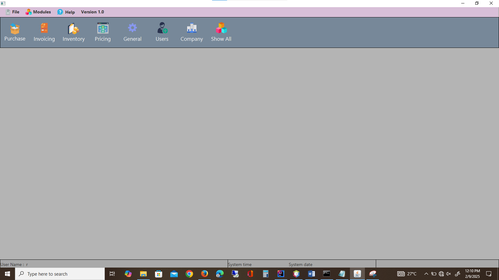

# 🖥️ IMS Desktop Client App

A **JavaFX-based Inventory Management System (IMS)** desktop client application. This project provides a graphical interface for managing inventory, purchase orders, credit notes, and product profiles, designed for businesses that need a lightweight desktop solution.

---

## 📌 Features
- User-friendly **JavaFX GUI**  
- Inventory management (add, update, view items)  
- Purchase order (LPO) creation and editing  
- Credit notes and order guide management  
- Product profile reporting  
- Exportable reports (e.g., LPOs, product profiles)  
- Screenshots included for UI previews  

---

## 🛠️ Tech Stack
- **Language:** Java  
- **Framework:** JavaFX  
- **Build Tool:** Maven  
- **UI Styling:** CSS  

---

## 📂 Project Structure
```
IMS-Desktop-Client-App/
│── .idea/                     # IDE configuration
│── .mvn/wrapper/              # Maven wrapper files
│── bin/                       # Compiled binaries
│── demo/                      # Demo resources
│── src/main/                  # Source code (controllers, views, models)
│── images/                    # Screenshots (UI previews, reports)
│── pom.xml                    # Maven project configuration
│── mvnw / mvnw.cmd            # Maven wrapper scripts
│── .gitignore                 # Git ignore rules
│── README.md                  # Documentation
```

---

## 🚀 Getting Started

### Prerequisites
- Java 17+  
- Maven 3.8+  

### Installation
1. Clone the repository:
   ```bash
   git clone https://github.com/erickomondi760/IMS-Desktop-Client-App.git
   cd IMS-Desktop-Client-App
   ```
2. Build the project:
   ```bash
   mvn clean install
   ```
3. Run the application:
   ```bash
   mvn javafx:run
   ```

---

## 📸 Screenshots

### Home Page
)


### Inventory Page



### LPO Editor
`[Looks like the result wasn't safe to show. Let's switch things up and try something else!]`

### Purchases & Credit Notes Page
`[Looks like the result wasn't safe to show. Let's switch things up and try something else!]`

### Sample Product Profile Report
`[Looks like the result wasn't safe to show. Let's switch things up and try something else!]`

---

## ☁️ Deployment

### Option 1: Local Execution
Run directly via Maven or your IDE (IntelliJ/Eclipse).

### Option 2: Executable JAR
Package the app:
```bash
mvn clean package
```
Run:
```bash
java -jar target/ims-desktop-client-app.jar
```

---

## 🔄 CI/CD Setup (GitHub Actions)
Automate builds and tests with GitHub Actions:

```yaml
name: Java CI with Maven

on:
  push:
    branches: [ "main" ]
  pull_request:
    branches: [ "main" ]

jobs:
  build:
    runs-on: ubuntu-latest
    steps:
    - name: Checkout code
      uses: actions/checkout@v3

    - name: Set up JDK 17
      uses: actions/setup-java@v3
      with:
        java-version: '17'
        distribution: 'temurin'

    - name: Build with Maven
      run: mvn clean install

    - name: Run tests
      run: mvn test
```

---

## 🤝 Contributing
Contributions are welcome!  
1. Fork the repo  
2. Create a new branch (`feature-xyz`)  
3. Commit changes  
4. Open a Pull Request  

---

## 📜 License
This project is licensed under the MIT License.
